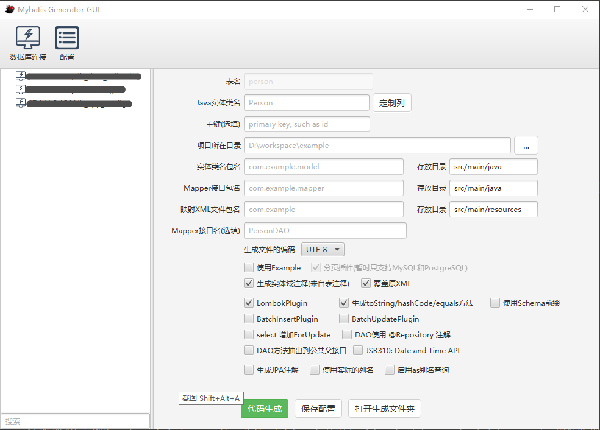

# mybatis-generator-gui

mybatis-generator-gui 是基于 [mybatis generator](http://www.mybatis.org/generator/index.html) 开发一款界面工具, 本工具可以使你非常容易及快速生成 Mybatis 的 Java POJO 文件及数据库 Mapping 文件。

### 核心特性

- 按照界面步骤轻松生成代码，省去 XML 繁琐的学习与配置过程
- 保存数据库连接与 Generator 配置，每次代码生成轻松搞定
- 内置常用插件，比如分页插件
- 支持 OverSSH 方式，通过 SSH 隧道连接至公司内网访问数据库
- 把数据库中表列的注释生成为 Java 实体的注释，生成的实体清晰明了
- 可选的去除掉对版本管理不友好的注释，这样新增或删除字段重新生成的文件比较过来清楚
- 目前已经支持 Mysql、Mysql8、Oracle、PostgreSQL 与 SQL Server，暂不对其他非主流数据库提供支持。(MySQL 支持的比较好，其他数据库有什么问题可以在 issue 中反馈)

### 运行要求（重要！！！）

本工具仅支持 Java 的 2 个最新的 LTS 版本，jdk8 和 jdk11

- jdk1.8 要求版本在<strong>1.8.0.60</strong>以上版本
- Java 11 无版本要求

### 运行

VSCode 中启动, 找到`com.zzg.mybatis.generator.Main`类并运行就可以了（VSCode 安装 Java 环境）

### 注意事项

- 本自动生成代码工具只适合生成单表的增删改查，对于需要做数据库联合查询的，请自行写新的 XML 与 Mapper；
- 部分系统在中文输入方法时输入框中无法输入文字，请切换成英文输入法；
- 如果不明白对应字段或选项是什么意思的时候，把光标放在对应字段或 Label 上停留一会然后如果有解释会出现解释；

### 其他

主要修改自用, 按自己的使用习惯修改.
